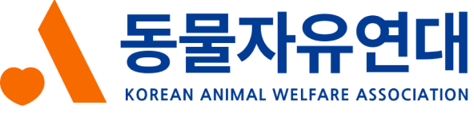

<!-- markdownlint-disable MD033 -->

<h1 align="center">동물자유연대</h1>
 
 
<h2>Intro</h2>

>  국내의 비영리단체 동물자유연대의 리뉴얼 사이트입니다. 
> 기존의 단순하고 옛스러운 느낌에서 탈피하여 현대적이고  
> 시선을 집중시킬 수 있도록 다양한 인터렉션 요소를 배치하였습니다.
>  

 

<h2>Page Link</h2>

아래의 링크를 통해 페이지들을 확인해보세요. :blush:  
 

- <a href="http://chkim.dothome.co.kr/">Main page</a>     
   
- <a href="http://chkim.dothome.co.kr/mission_vision.php">Sub1 page</a>     
   
- <a href="http://chkim.dothome.co.kr/donation.php">Sub2 page</a>     
   

- Design with Figma <a href="https://www.figma.com/file/U40tBrD4nOVaZRgRGRpkDD/CHANEL-22-bag?type=design&node-id=0%3A1&mode=design&t=Qz4mM7kRrQI3rVkm-1"> 동물자유연대 리뉴얼</a>
 
 
<h2>Technology Stack</h2>

- **Design tool**   
  - Figma 
    
  - Photoshop 
    
  - Illustrator 
    
     
- **Web Development Technologies**   
  - HTML5 
    
  - CSS3 
    
  - SCSS 
    
  - JavaScript 
    
  - JQuery 
    
     
